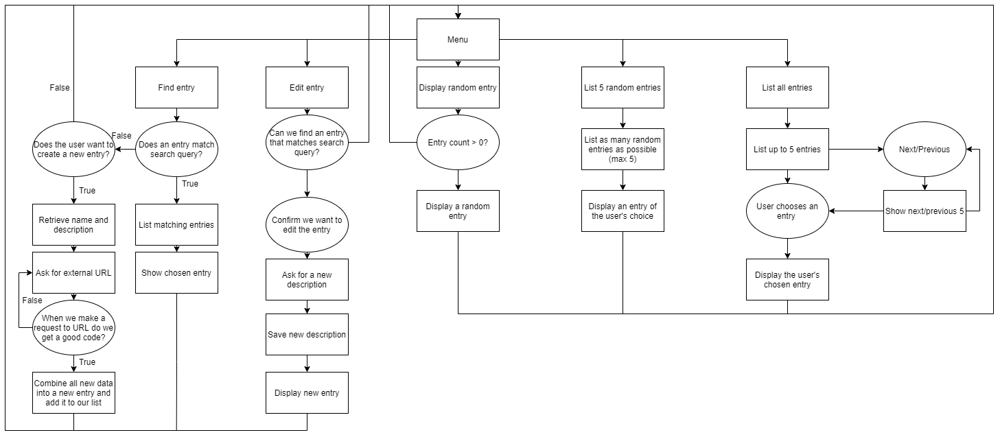
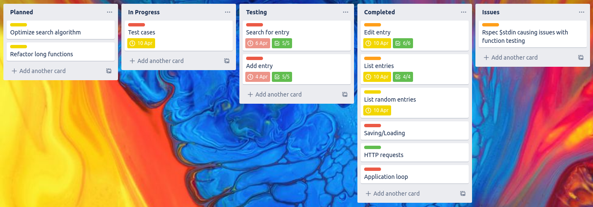

# Mythological Bestiary
## Purpose and scope: 
This application will record, document and provide information on a myriad of mythical creatures.  
It will also allow the user to edit any information, and will allow the user to create new entries on creatures  
that aren't already features in the bestiary.  
The user will be able to search for certain creatures, or simply browse as they please.  

This app will give an easy place for those who wish to browse and learn about mythical creatures,  
and I'm choosing to develop this because, I myself am interested in various mythologies and think this is  
a challenging and interesting app to develop.  

The app will be easy for the user to use, with various menus controlled all in app.

## Features and uses:
### Searching:
- I'll be developing a search algorithm which will allow the user to find any creature they're looking for,  
it will take in any string they input and return a creature which completely matches or is the most closely matching  
when taking into account descriptions and histories.

### Adding new entries:
- When searching for a creature, if they come across something that doesn't find an entry, they will be able to enter  
a new entry and fill it with whatever data they know, or can find themself.  
This new entry will be saved and will be loaded next time the application is opened.

### Editing entries
- Users will also be able to edit existing entries, names will not be changeable, but all descriptions and histories of a  
creature will be open to change.

## Outline of user interaction and experience:
- Users will be told how to interact with each feature through terminal output and menu descriptions.
- Users will interact through using tty-prompt menus and terminal inputs.
- Errors when/if they exist will be handled through rescues, and the issues will be displayed to the user through terminal outputs as well.

## Control flow of application

## Task tracking system

## Help documentation
1. download all files from repository
2. locate gemfile in terminal 
3. run bundler install
4. run ruby bestiary-app.rb