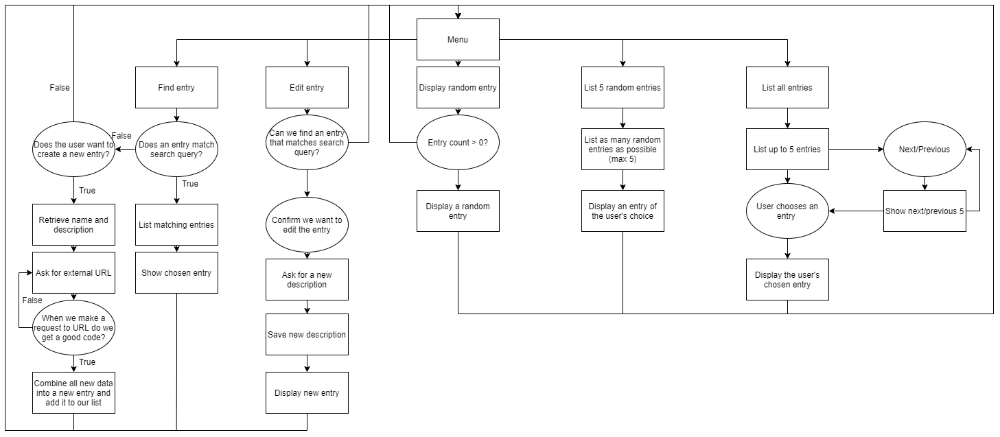

# Mythological Bestiary
## Access
[Link to repository](https://github.com/Deeon-Burgan/DeeonBurgan_T1A3)
[Link to Trello](https://trello.com/b/26ZYSELf/bestiary-console-app)

## Purpose and scope: 
This application will act as a personal bestiary for any user, that will record, document and provide information on a myriad of mythological creatures, that the user has come across and provided information on.  
The main function of the bestiary is the ability to search for entries that are already exist in the saved data. If an entry doesn't exist in the data file, the user will be given the chance to create a new one for whatever creature they have discovered, and in this case they'll give it a name, a description, and if they want, a link to an external site to provide more information.  
The application will allow the user to edit any entry, by changing the description of the creature, but keeping the name intact.  
There will be a number of ways for the user to browse their bestiary, including listing random entries, displaying a single random entry, and lastly simply lising all existing entries in alphabetical order, giving the user the ability to choose something that they wish to study.

This app will give those who are interested in any mythologies, or mythological creatures, a platform and place to go to if they wish to keep track of beasts they have learned about or have heard about. I've chosen to create this application because I and my partner are interested in learning about and keeping track of our own knowledge of creatures whether they're real or mythological, and having a personal bestiary to track everything we know is a great way for us to study what we know.

The app will be easy for the user to use, with various menus controlled all in app. The app will explain how to use each feature and will show the user how to use everything available to them.

## Features and uses:
### Searching:
- I'll be developing a search algorithm which will allow the user to find any creature they're looking for,  
it will take in any string they input and return a creature which completely matches or is the most closely matching  
when taking into account descriptions and histories.  
The search algorithm will find all appropriate entries which include any search tags, and then will  
allow the user to choose between those found, or give them an option to create a new entry, if the entry they are looking for isn't found.

### Adding new entries:
- When searching for a creature, if they come across something that doesn't find an entry, they will be able to enter  
a new entry and fill it with whatever data they know, or can find themself.  
When adding entries, the user will be able to add an external link if they wish, to link to a place that has more detail than they want to input. If no link is given, or the given link doesn't work, a default link to a wikipedia entry will be tried, and saved if it exists.
This new entry will be saved and will be loaded next time the application is opened.

### Editing entries
- Users will also be able to edit existing entries, names will not be changeable, but all descriptions and histories of a  
creature will be open to change.

## Outline of user interaction and experience:
- Users will be told how to interact with each feature through terminal output and menu descriptions.
- Users will interact through using tty-prompt menus and terminal inputs.
- Errors when/if they exist will be handled through rescues, and the issues will be displayed to the user through terminal outputs as well.

## Control flow of application

## Task tracking system

## Help documentation
1. download all files from repository
2. locate gemfile in terminal 
3. run bundler install
4. run ruby bestiary-app.rb  

or  

1. download all files from repository
2. run bash on bestiary-app.sh  

or  

1. download all files from repository
2. navigate to gemfile
3. run bundler install
4. run the file path of bestiary-app.rb in terminal